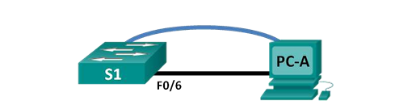

# Lab 1  Basic Switch Configuration

## Topology

## Addressing Table:
| Device | Interface | Ip Address | Subnet Mask | Default Gateway |
|:-------:|:--------|:------------:|:-----------:|:-------------|
|SW1   | VLAN 99    | 192.168.1.2 | 255.255.255.0 | 192.168.1.1 |
|PC-A    | NIC   | 192.168.1.10  | 255.255.255.0  | 192.168.1.1 |

## Objectives 
 -  Cable the network and verify the default switch configuration
 - Configure basic network device settings
 - Verify and test network connectivity
 - Manage the MAC address table

## Required Resources:
*  1 Cisco 2960 Switch 
*  1 PC (with terminal emulation program) 
*  Console cable
*  Ethernet cable  

## Important: 
Cisco switches can be configured with a special IP address known as switch virtual interface (SVI) or management 
address. SVI can be used for remote access to the switch to display or configure settings. If the VLAN 1 SVI is
 assigned an IP address, by default, all ports in VLAN 1 have access to the SVI management IP address.   
In this lab, you will build a simple topology using Ethernet LAN cabling and access a Cisco switch using the console  
and remote access methods. You will examine default switch configurations before configuring basic switch settings.  
These basic switch settings include device name, interface description, local passwords, message of the day (MOTD) 
banner, IP addressing, setting up a static MAC address, and demonstrating the use of a management IP address for 
remote switch management. The topology consists of one switch and one host using only Ethernet and console ports